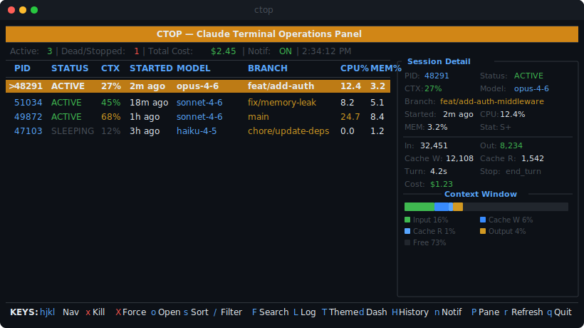
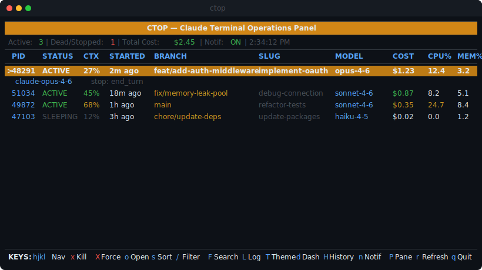
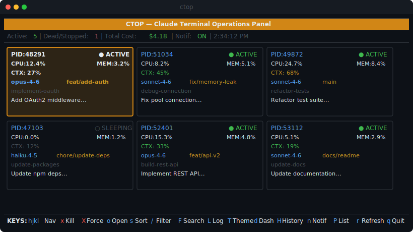
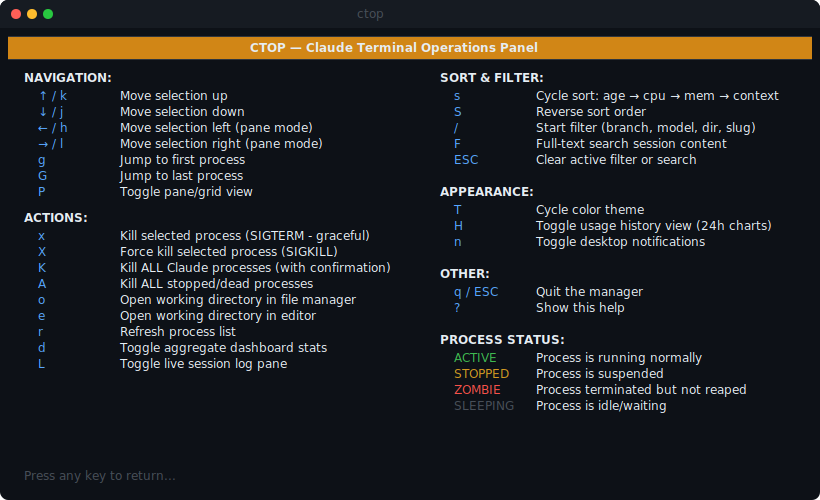

# CTOP — Claude Terminal Operations Panel

[](LICENSE)
[](#requirements)
[](#requirements)
[](#)
[](#contributing)

**A terminal UI for monitoring and managing Claude Code sessions.** Think `htop`, but for your Claude processes.

Track CPU, memory, token usage, context window saturation, active branches, and more — all from a single terminal pane.



---

## Features

- **Real-time process monitoring** — CPU, memory, status, uptime for every Claude session
- **Context window tracking** — visual bar showing input, cache, output, and free context (out of 200k)
- **Cost estimation** — per-session and total API cost based on model pricing
- **Sparkline graphs** — inline CPU/memory trend charts using Unicode block characters
- **Token breakdown** — input, output, cache creation, and cache read token counts per session
- **Session metadata** — model, branch, slug, session ID, service tier, version
- **Two view modes** — list view (table) and pane view (card grid)
- **Live log tailing** — stream session conversation in a split pane (`L`)
- **Session search** — full-text search across conversation content (`F`)
- **Aggregate dashboard** — total tokens, cost, and context stats across all sessions (`d`)
- **Historical tracking** — 24-hour usage charts persisted to disk (`H`)
- **Process control** — kill individual or all sessions (graceful `SIGTERM` or force `SIGKILL`)
- **Quick-jump** — open project directory in Finder (`o`), editor (`e`), or terminal (`t`)
- **Desktop notifications** — get notified when a session completes (macOS/Linux)
- **Vim-style navigation** — `hjkl`, `g`/`G`, arrow keys, plus mouse support
- **Sort & filter** — sort by CPU, memory, context %; filter by branch, model, directory, or slug
- **Color themes** — 5 built-in themes (default, minimal, dracula, solarized, monokai) + custom
- **Braille context bars** — sub-character precision context visualization (configurable)
- **Plugin system** — extend with custom columns via `~/.ctop/plugins/`
- **Configurable** — refresh interval, context limit, default view, themes via `~/.ctoprc` or CLI flags
- **Cross-platform** — macOS, Linux, and Windows
- **Zero dependencies** — pure Node.js, no `npm install` required
- **Auto-refresh** — configurable interval (default 5s)





---

## Installation

### Homebrew (macOS/Linux)

```bash
brew tap aakashadesara/ctop
brew install ctop-claude
```

### npm (recommended)

```bash
npm install -g ctop-claude
ctop
```

Or run without installing:

```bash
npx ctop-claude
```

### From source

```bash
git clone https://github.com/aakashadesara/ctop.git
chmod +x ctop/claude-manager
ln -s "$(pwd)/ctop/claude-manager" /usr/local/bin/ctop
```

### One-liner

```bash
curl -o /usr/local/bin/ctop https://raw.githubusercontent.com/aakashadesara/ctop/main/claude-manager
chmod +x /usr/local/bin/ctop
```

### Verify

```bash
ctop
```

If no Claude processes are running, you'll see an empty state. Start a Claude Code session and `ctop` will pick it up on the next refresh.

---

## Recommended aliases

Add these to your `~/.zshrc` or `~/.bashrc`:

```bash
# Launch ctop
alias ctop="/usr/local/bin/ctop"

# Quick-kill all Claude sessions (no TUI, just nuke them)
alias ckill="pkill -f 'claude'"
```

Then reload:

```bash
source ~/.zshrc
```

---

## Usage

### Keyboard shortcuts

| Key | Action |
|-----|--------|
| `↑` / `k` | Move selection up |
| `↓` / `j` | Move selection down |
| `←` / `h` | Move left (pane mode) |
| `→` / `l` | Move right (pane mode) |
| `g` | Jump to first process |
| `G` | Jump to last process |
| `P` | Toggle list / pane view |
| `s` | Cycle sort: age → cpu → mem → context |
| `S` | Reverse sort order |
| `/` | Start filter (type to search, Enter to confirm) |
| `F` | Full-text search session conversation content |
| `ESC` | Clear filter/search (or quit if none active) |
| `r` | Refresh process list |
| `x` | Kill selected process (SIGTERM) |
| `X` | Force kill selected process (SIGKILL) |
| `K` | Kill ALL Claude processes |
| `A` | Kill all stopped/zombie processes |
| `o` | Open project directory in file manager |
| `e` | Open project directory in editor |
| `t` | Open new terminal in project directory |
| `d` | Toggle aggregate dashboard |
| `L` | Toggle live log tailing split pane |
| `H` | Toggle 24-hour usage history view |
| `T` | Cycle color theme |
| `n` | Toggle desktop notifications |
| `?` | Show help |
| `q` | Quit |

Mouse support: click to select, scroll wheel to navigate.



### Context window visualization

The context bar shows how much of the 200k token window is consumed:

```
[████████░░░░░░░░░░░░░░░░░░░░░░] 27% used
 ▲ green   ▲ blue     ▲ cyan      ▲ yellow  ▲ gray
 input     cache-w    cache-r     output    free
```

Color coding:
- **Green** — 70%+ free (healthy)
- **Yellow** — 40–70% free
- **Orange** — 10–40% free (getting tight)
- **Red** — <10% free (near limit)

### Detail pane

On wide terminals (140+ cols), a detail pane appears showing full session info: model, branch, slug, token breakdown, turn duration, session ID, and more.


---

## Configuration

### CLI flags

```bash
ctop --refresh 3          # Refresh every 3 seconds
ctop --context-limit 128000  # Set context window to 128k
ctop --pane               # Start in pane/grid view
```

### Config file (`~/.ctoprc`)

```json
{
  "refreshInterval": 5000,
  "contextLimit": 200000,
  "defaultView": "list",
  "theme": "default",
  "contextBarStyle": "block",
  "notifications": {
    "enabled": true,
    "minDuration": 30
  }
}
```

| Option | Values | Description |
|--------|--------|-------------|
| `refreshInterval` | milliseconds | How often to refresh (default: 5000) |
| `contextLimit` | tokens | Context window size (default: 200000) |
| `defaultView` | `"list"` / `"pane"` | Starting view mode |
| `theme` | `"default"` / `"minimal"` / `"dracula"` / `"solarized"` / `"monokai"` | Color theme |
| `contextBarStyle` | `"block"` / `"braille"` | Context bar rendering style |
| `notifications.enabled` | boolean | Desktop notifications on session completion |
| `notifications.minDuration` | seconds | Minimum session duration to trigger notification |

CLI flags override config file values.

---

## Requirements

- **macOS, Linux, or Windows** (uses `ps` + `lsof` on macOS, `ps` + `/proc` on Linux, PowerShell on Windows)
- **Node.js 18+**
- **Claude Code** installed and running sessions

### Windows notes

On Windows, ctop uses PowerShell to detect Claude processes and retrieve process information. Process working-directory detection is limited compared to macOS/Linux -- ctop will fall back to the executable path when the true CWD is unavailable. Kill uses `taskkill`, file explorer uses `explorer`, and terminal opens `cmd`. Notifications use a PowerShell `MessageBox` popup.

---

## How it works

`ctop` reads process info from `ps` (or PowerShell on Windows), resolves working directories via `lsof` (or `Get-CimInstance` on Windows), and enriches each process with session metadata by parsing Claude Code's local `.jsonl` session files in `~/.claude/projects/`. No network calls. No external dependencies. Everything stays local.

---

## Plugins

Extend CTOP with custom columns and detail rows. Create `.js` files in `~/.ctop/plugins/`:

```js
// ~/.ctop/plugins/my-plugin.js
module.exports = {
  name: 'my-plugin',
  column: {
    header: 'CUSTOM',
    width: 10,
    getValue: (proc) => proc.cwd ? 'yes' : 'no',
  },
};
```

See `examples/plugins/uptime.js` for a complete example.

---

## Roadmap

- [x] **Linux support** — `ps` + `/proc` based process detection
- [x] **npm package** — `npm install -g ctop-claude`
- [x] **Configurable settings** — refresh interval, context limit, default view
- [x] **Sort & filter** — sort by age/CPU/memory/context, filter by branch/model/dir
- [x] **Windows support** — PowerShell-based process detection
- [x] **Homebrew formula** — `brew install ctop-claude`
- [x] **Cost estimation** — per-session and aggregate API cost tracking
- [x] **Sparkline graphs** — inline CPU/memory trend visualization
- [x] **Live log tailing** — stream session conversation in split pane
- [x] **Session search** — full-text search across conversation content
- [x] **Aggregate dashboard** — totals across all sessions
- [x] **Historical tracking** — 24-hour usage charts
- [x] **Desktop notifications** — notify on session completion
- [x] **Quick-jump** — open project in Finder/editor/terminal
- [x] **Mouse support** — click to select, scroll to navigate
- [x] **Color themes** — 5 built-in + custom theme support
- [x] **Braille context bars** — sub-character precision rendering
- [x] **Plugin system** — custom columns via `~/.ctop/plugins/`
- [x] **Modular codebase** — split into `src/` modules

---

## Contributing

PRs are welcome!

```bash
# Fork & clone
git clone https://github.com/<your-username>/ctop.git
cd ctop

# Run directly
./claude-manager

# Run tests
npm test
```

The codebase is split into modules under `src/` with `claude-manager` as the entry point. Tests are in `test/` using Node.js built-in test runner.

Areas where contributions would be especially helpful:

- **Windows testing** — basic support is in, needs real-world validation
- **Linux testing** — basic support is in, needs real-world validation
- **Performance** — profiling on systems with many Claude sessions

Please open an issue first for large changes so we can discuss the approach.

---

## License

[MIT](LICENSE) — use it however you want.
